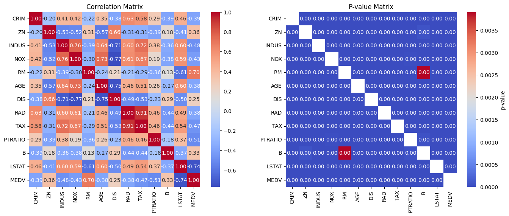
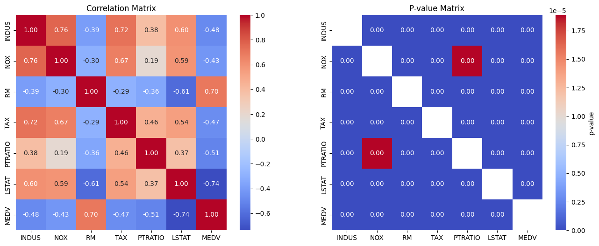
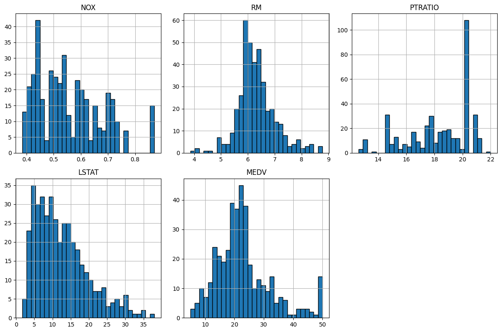
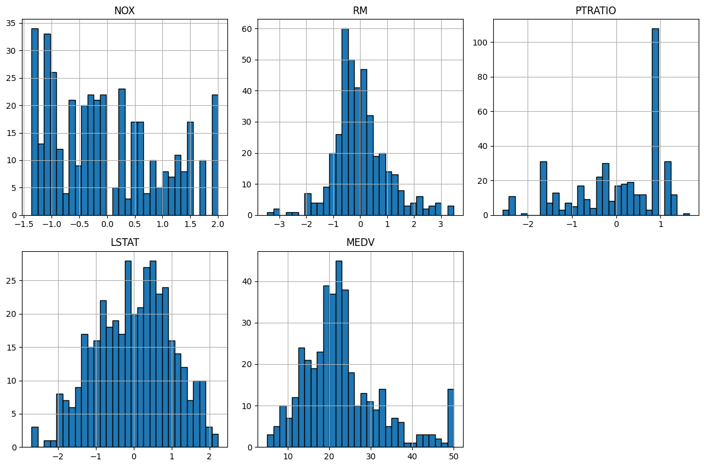
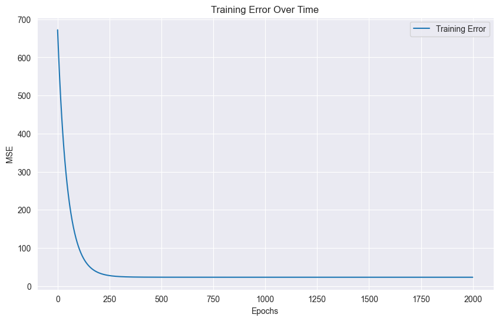
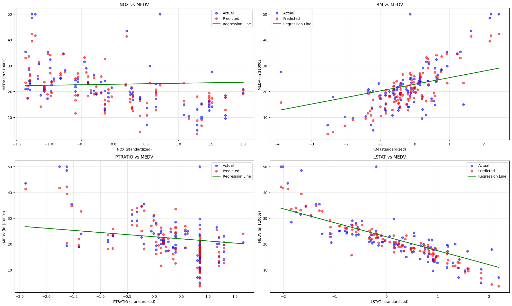
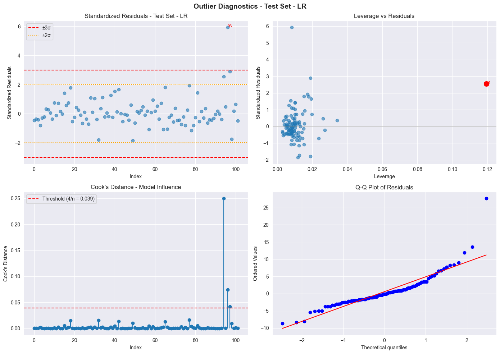
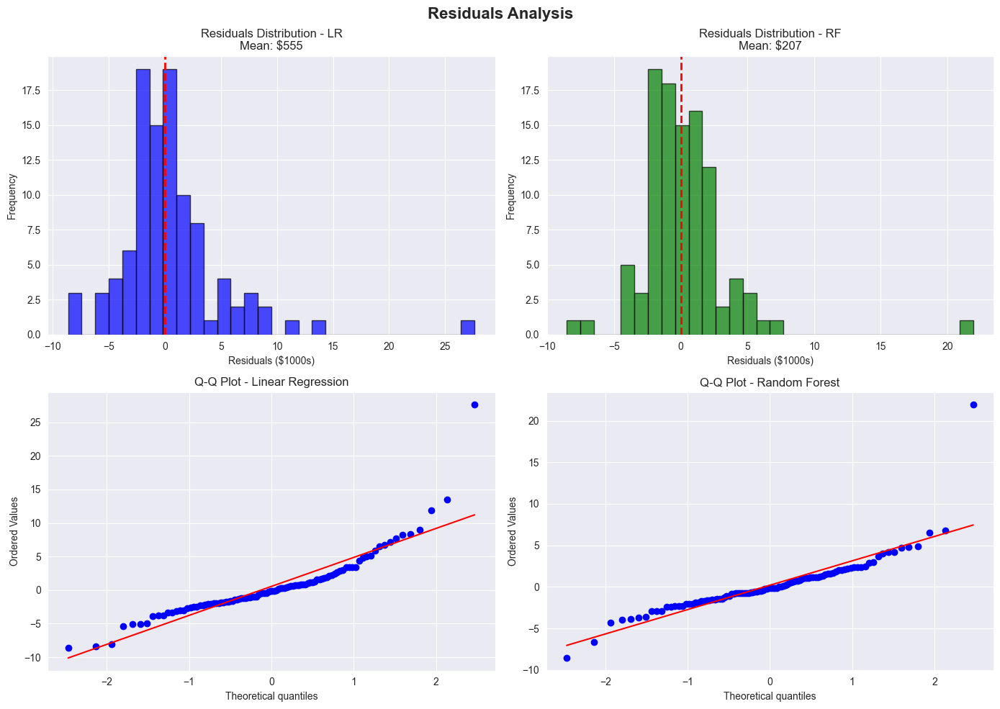
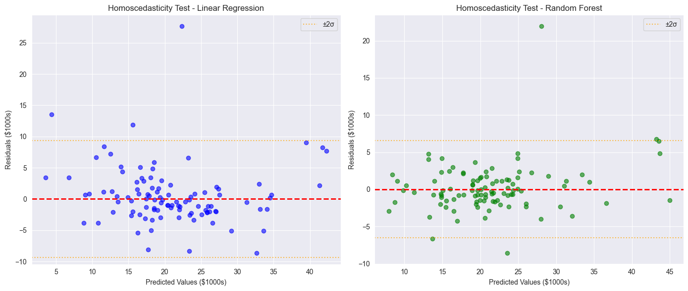

# Boston Housing Regression Project

**Autor:** Diego Antonio García Padilla (A01710777)

**Fecha:** 31 de agosto de 2025

---

## Abstract

Implementación de un modelo de regresión lineal y otro de Random Forest en Python para predecir el precio de viviendas en Boston, utilizando el dataset de Boston Housing. Se realiza una limpieza y transformación de datos, seguido de la evaluación y optimización de los modelos usando métricas como $ R^2 $, $ MSE $, análisis de residuos y homocedasticidad.

## 1. Introducción

La regresión lineal es un método estadístico que permite modelar la relación entre una variable dependiente y una o más variables independientes. En este proyecto, implementé un modelo de regresión lineal con múltiples variables para predecir el precio de las viviendas en Boston, utilizando el dataset de [Boston House Price Dataset](https://www.kaggle.com/datasets/fedesoriano/the-boston-houseprice-data/data).

Este dataset presenta desafíos como la presencia de multicolinearidad entre datos socioeconómicos, datos censurados y distribuciones sesgadas, lo que hizo de la limpieza y transformación de datos un proceso retador.

Para realizar el modelo, utilicé Jupyter Notebook como entorno de desarrollo, junto con librerías de Python como `numpy`, `pandas`, `matplotlib`, `seaborn` y `scikit-learn`.

Implementé el algoritmo de regresión lineal desde cero, utilizando el descenso de gradiente para ajustar los parámetros del modelo.


## 2. Preparación del entorno

Para este proyecto utilicé las siguientes librerías de Python, instaladas en un entorno virtual:

- `numpy`: Para operaciones matemáticas y manejo de arrays
- `pandas`: Para manipulación y análisis de datos
- `matplotlib` y `seaborn`: Para visualización de datos
- `scipy`: Para pruebas estadísticas y transformaciones
- `scikit-learn`: Para división de datos, estandarización y métricas de evaluación

Además, fijé una semilla aleatoria (42) para garantizar la reproducibilidad de los resultados.

Para activar el entorno virtual, puede utilizar el siguiente comando dentro del directorio del proyecto:

```bash
source venv/bin/activate
```

## 3. ETL

### 3.1 Extracción

En primer lugar, descargué el dataset de Boston Housing desde [Kaggle](https://www.kaggle.com/datasets/fedesoriano/the-boston-houseprice-data/data) y lo almacené en la raíz del proyecto.

A continuación, describo los features del dataset:

| Feature   | Descripción                                                                                               | Rango              |
| --------- | --------------------------------------------------------------------------------------------------------- | ------------------ |
| `CRIM`    | Tasa de criminalidad per cápita por ciudad.                                                               | [0.00632, 88.9762] |
| `ZN`      | Proporción de terrenos residenciales zonificados para lotes de más de 25,000 pies cuadrados.              | [0.0, 100.0]       |
| `INDUS`   | Proporción de acres de negocios no minoristas por ciudad.                                                 | [0.46, 27.74]      |
| `CHAS`    | Variable que toma el valor de 1 si el tramo de la ciudad limita con el río Charles y 0 en caso contrario. | [0, 1]             |
| `NOX`     | Concentración de óxidos nítricos (partes por 10 millones).                                                | [0.385, 0.871]     |
| `RM`      | Número promedio de habitaciones por vivienda.                                                             | [3.561, 8.78]      |
| `AGE`     | Proporción de unidades ocupadas por sus propietarios construidas antes de 1940.                           | [2.9, 100.0]       |
| `DIS`     | Distancias ponderadas a cinco centros de empleo de Boston.                                                | [1.1296, 12.1265]  |
| `RAD`     | Índice de accesibilidad a las autopistas radiales.                                                        | [1, 24]            |
| `TAX`     | Tasa de impuestos sobre la propiedad de Boston por cada $10,000.                                          | [187, 711]         |
| `PTRATIO` | Relación alumno-maestro por ciudad.                                                                       | [12.6, 22.0]       |
| `B`       | 1000(Bk - 0.63)^2 donde Bk es la proporción de personas de ascendencia afroamericana por ciudad.          | [0.32, 396.9]      |
| `LSTAT`   | Porcentaje de residentes de menor estatus.                                                                | [1.73, 37.97]      |
| `MEDV`    | Valor mediano de las viviendas ocupadas por sus propietarios en $1000s.                                   | [5.0, 50.0]        |


Posteriormente identifiqué variables categóricas, como `CHAS` y `RAD` (aunque `RAD` no es estrictamente categórica, ya que es un índice, se trató como tal en el análisis), y las eliminé del conjunto de datos, ya que quería simplificar el modelo y reducir la dimensionalidad.

### 3.2. Transformación

#### 3.2.1. Selección de Features

Esta fue la parte más retadora del proceso. Para empezar, analicé la correlación y $p_{value}$ entre los features utilizando la función `df.corr()` y `stats.pearsonr()` de la librería `scipy`.



A partir de esto, a pesar de que el $p_{value}$ de todos los features demostraba que eran estadísticamente significativos, decidí realizar una selección de los features más relevantes a partir de su correlación con la variable objetivo `MEDV`.

Con base en esto, eliminé aquellos features que tenían una $ |corr| < 0.4 $: `CRIM`, `ZN`, `AGE`, `DIS`, `RAD` y `B`.

Posteriormente, volví a graficar la matriz de correlación y $p_{value}$ de los features restantes, para analizar posibles multicolinealidades.



Como se puede visualizar, existe una alta correlación entre los features `INDUS`, `NOX` y `TAX`. Esto hace sentido, ya que, a mayor industrialización (`INDUS`), se espera una mayor contaminación por óxidos nítricos (`NOX`) y, por ende, una mayor tasa de impuestos sobre la propiedad (`TAX`).

Para evitar problemas de multicolinealidad, decidí eliminar uno de los features altamente correlacionados. En este caso, opté por eliminar `INDUS` y `TAX`. En primer lugar, eliminé `INDUS`, ya que tenía una correlación ligeramente más alta con `NOX` y `TAX`. Y posteriormente, eliminé `TAX`, ya que, además de su alta correlación con `NOX`, también era un feature altamente sesgado hacia la derecha, debido al tope máximo a los impuestos en Boston, donde solían topar datos como los salarios en \$999,999 o edades reportadas como "99+".

#### 3.2.2. Separación de datos en entrenamiento y prueba

Para la separación de los datos en conjuntos de entrenamiento y prueba, utilicé la función `train_test_split` de la librería `sklearn`. Asigné el 80% de los datos al conjunto de entrenamiento y el 20% al conjunto de prueba.

#### 3.2.3. Transformaciones de datos

Para identificar qué features requerían transformaciones, grafiqué la distribución de cada uno de ellos utilizando histogramas. Esto me permitió visualizar la asimetría y la presencia de outliers en los datos.



A partir de esto identifiqué lo siguiente:

- `LSTAT` está sesgado a la derecha, con una cola larga. Utilicé una transformación logarítmica para normalizar su distribución.
- `NOX` también está sesgado. Utilicé winsorization para limitar los valores en los percentiles 5 y 95.

Implementé estas transformaciones en los conjuntos de entrenamiento y prueba.

#### 3.2.4. Estandarización ($z_{score}$)

Para estandarizar los datos, utilicé la clase `StandardScaler` de la librería `sklearn`. Esto me permitió transformar los datos para que tuvieran una media de 0 y una desviación estándar de 1.

```python
from sklearn.preprocessing import StandardScaler

scaler = StandardScaler()
X_train_scaled = scaler.fit_transform(X_train)
X_test_scaled = scaler.transform(X_test)
```

Es importante no aplicar la estandarización antes de realizar la separación en conjuntos de entrenamiento y prueba, ya que esto podría llevar a la filtración de información del conjunto de prueba al conjunto de entrenamiento.

A continuación, muestro los histogramas después de la transformación y estandarización:



Posteriormente, volví a construir mis dataframes de entrenamiento y prueba a partir de los datos estandarizados. Y los utilicé para entrenar y evaluar mis modelos.

## 4. Regresión Lineal

### 4.1 Funciones de ayuda

Para entrenar mi modelo, utilicé el método de optimización del gradiente descendente. Para ello, desarrollé las siguientes funciones.

1. `h(x: np.ndarray, theta: np.ndarray, b: float)`: La función de hipótesis que predice el valor de salida dado un conjunto de características `x`, un vector de parámetros `theta` y un sesgo `b`.

$$
h(x, \theta, b) = \theta^T x + b
$$

```python
def h(x: np.ndarray, theta: np.ndarray, b: float) -> float:
    """
    Hypothesis function for linear regression.

    Predicts the median housing price in $1000s.

    Parameters:

    - x: Vector of feature values
    - theta: Vector of model parameters
    - b: Bias term

    Returns:
    - Predicted median housing price in $1000s
    """
    return np.dot(x, theta) + b
```

2. `mse(y_true: np.ndarray, y_pred: np.ndarray) -> float`: La función que calcula el error estándar de las predicciones.

$$
MSE = {\frac{1}{n} \sum_{i=1}^{n} (y_{true}^{(i)} - y_{pred}^{(i)})^2}
$$

```python
def mse(y_true: np.ndarray, y_pred: np.ndarray) -> float:
    """
    Calculate the mean standard error of the predictions.

    Parameters:
    - y_true: Vector of true median housing prices in $1000s
    - y_pred: Vector of predicted median housing prices in $1000s

    Returns:
    - Standard error of the predictions
    """
    return float(np.mean((y_true - y_pred) ** 2))
```

3. `gradient_descent(X: np.ndarray, y: np.ndarray, alpha: float, epochs: int) -> Tuple[np.ndarray, float, list]`: La función que implementa el algoritmo de descenso de gradiente para optimizar los parámetros del modelo y devuelve los parámetros optimizados, el sesgo y el historial de errores a lo largo de las épocas.

$$
\theta = \theta - \frac{\alpha}{m} \nabla J(\theta, b)
$$

```python
def gradient_descent(X: np.ndarray, y: np.ndarray, theta: np.ndarray, b: float, learning_rate: float, epochs: int) -> Tuple[np.ndarray, float, list]:
    """
    Perform gradient descent to optimize the model parameters.

    Parameters:
    - X: Feature matrix
    - y: True median housing prices in $1000s
    - theta: Initial model parameters
    - b: Initial bias term
    - learning_rate: Learning rate for gradient descent
    - epochs: Number of iterations to run gradient descent

    Returns:
    - (theta, b, error_history): Tuple of optimized model parameters, bias term, and error history
    """
    m = len(y)
    error_history = []
    for _ in range(epochs):
        y_pred = h(X, theta, b)
        error = y_pred - y
        error_history.append(mse(y, y_pred))
        theta -= (learning_rate / m) * np.dot(X.T, error)
        b -= (learning_rate / m) * np.sum(error)
    return theta, b, error_history
```

### 4.2 Entrenamiento

Para entrenar el modelo, utilicé el método de optimización del gradiente descendente.

Primero, inicialicé los parámetros del modelo y luego llamé a la función `gradient_descent` para ajustar los parámetros.

```python
hypothesis_theta = np.random.randn(X_train.shape[1])
hypothesis_bias = np.random.randn()
learning_rate = 0.01
EPOCHS = 2000

theta, bias, error_history = gradient_descent(X_train.values, y_train.values, hypothesis_theta, hypothesis_bias, learning_rate, EPOCHS)
```

Los resultados del entrenamiento son los siguientes:

- Optimized parameters (theta): $[ 0.37736466  2.56786854 -1.64178716 -5.4044917 ]$
- Optimized bias (b): $22.796534608345972$
- Last training error (MSE): $23.04935294220249$

En esta gráfica se puede observar la evolución del error de entrenamiento a lo largo de las épocas.



## 5. Evaluación

### 5.1 Comparación de Predicciones

Aquí podemos comparar las predicciones del modelo con los valores reales del conjunto de prueba. Además de la línea de tendencia.

Como podemos visualizar, `LSTAT` es la variable con menor varianza, lo que sugiere que tiene un impacto significativo en las predicciones. `RM` también parece tener un efecto considerable, lo que indica que la cantidad de habitaciones en una vivienda es un predictor importante del precio. Y por último, `NOX` y `PTRATIO` parecen tener mayor varianza, pero aún así muestran una tendencia clara.



### 5.2 Rendimiento

Para evaluar el rendimiento del modelo, utilicé el conjunto de prueba y calculé el error cuadrático medio (RMSE) de las predicciones.

```python
y_pred = h(X_test.values, theta, bias)
test_rmse = mse(y_test.values, y_pred)
```

- Test error (MSE): $22.074920080958695$

Además, calculé el coeficiente de determinación ($ R^2 $) para ambos conjuntos de datos, de entrenamiento y prueba. 

Esto puede ayudar a entender mejor el rendimiento del modelo, ya que indica la proporción de la varianza en la variable dependiente que es predecible a partir de las variables independientes.

Además, si tenemos $ R^2 $ muy distintas entre el conjunto de entrenamiento y el de prueba, esto puede ser un indicativo de sobreajuste.

```python
from sklearn.metrics import r2_score

train_r2 = r2_score(y_train.values, h(X_train.values, theta, bias))
test_r2 = r2_score(y_test.values, y_pred)

print("Train R^2:", train_r2)
print("Test R^2:", test_r2)
```

- Train R^2: $0.7346763076748004$
- Test R^2: $0.6989802089891052$

La diferencia entre los $ R^2 $ de entrenamiento y prueba es muy baja, lo que sugiere que el modelo no está sobreajustado.

### 5.3 Análisis de datos atípicos e influyentes

Para analizar el impacto de los outliers en el modelo, realicé los siguientes análisis:

- **Outliers extremos**: observaciones con residuos estandarizados > 3 $ \sigma $
- **Puntos influyentes**: observaciones con alta leverage y alto residuo
- **Cook's Distance**: puntos que superan el umbral 4/n



Los resultados fueron muy interesantes. Identífiqué tres outliers extremos, el más notorio siendo una casa de \$50,000 predicha como $22,388 (error de casi 6 STD). Sin embargo, estos casos pudieron referirse a propiedades con características únicas no capturadas por los features utilizados, como el valor histórico por ejemplo.

Además de esos 3 outliers, identifiqué 7 más. Lo interesante viene al probar el modelo con y sin dichos outliers. El sentido común nos suele decir es que el modelo mejorará si eliminamos estos valores atípicos, pero en este caso pasó lo contrario.


| Model            | N_train | R² Test  | RMSE Test | $\Delta$R² | $\Delta$RMSE |
|------------------|---------|----------|-----------|------------|--------------|
| With all data    | 404     | 0.699094 | 4.697509  | 0.000000   | 0.000000     |
| Without outliers | 394     | 0.673188 | 4.895545  | -0.025906  | 0.198036     |

Por esta razón, decidí mantenerlos en el modelo, ya que estos valores pueden representar variabilidad real del mercado inmobiliario y hacer el modelo más robusto ante valores atípicos.

## 6. Random Forest

Dado a que la regresión lineal básica tuvo limitaciones, implementé un modelo de Random Forest como alternativa. Este algoritmo se basa en construir múltiples árboles de decisión y promediando sus predicciones, siendo naturalmente robusto ante outliers y capaz de modelar interacciones complejas entre variables, algo común en el dataset de Boston Housing.

Para la implementación inicial, utilicé todos los features disponibles excepto `CHAS` (categórica) y `B` (por consideraciones éticas), sin aplicar las transformaciones utilizadas en regresión lineal, ya que Random Forest no las requiere.

### 6.1 Modelos iniciales

Mi primer approach con Random Forest utilicé los siguientes parámetros:

* `n_estimators=200`: Un número moderadamente alto para asegurar estabilidad en las predicciones sin tener un costo excesivamente alto.
* `max_depth=15`: Profundidad suficiente para capturar patrones complejos en datos inmobiliarios con variabilidad compleja.
* `min_samples_split=5`: Un valor bajo que permita divisiones granulares en un dataset con pocos datos (404).
* `min_samples_leaf=2`: Mínimo conservador que evita hojas de una sola muestra.
* `max_features='sqrt'`: Estrategia estandar que usa $\sqrt{11} \approx 3$ features por split, promoviendo diversidad mientras mantiene poder predictivo en cada división.

Con estos parametros llegué a estos resultados:

| Train $R^2$ | Test $R^2$ | MSE Test |
|-------------|------------|----------|
| $0.9542$    | $0.8639$   | $9.9770$ |

Aquí noté un ligero overfitting, visible por la diferencia de  $0.09$ en $R^2$ entre train y test. Por lo que probé con otros hiperparámetros:

* `max_depth=8`: Menor profundidad para evitar que el modelo se sobreajuste a los valores de entrenamiento.
* `min_samples_split=10`: Limita la fragmentación de los árboles y generaliza las reglas.
* `min_samples_leaf=5`: Exige más datos por hoja, lo que genera reglas más estables y robustas.

Tras este cambio obtuve los siguientes resultados:

| Train $R^2$ | Test $R^2$ | MSE Test  |
|-------------|------------|-----------|
| $0.9036$    | $0.8265$   | $12.7253$ |

Si bien la diferencia entre las $R^2$ fue ligeramente menor, ambos $R^2$ disminuyeron significativamente y el error creció. Es decir, este cambio degradó el modelo.

### 6.2 Optimización de hiperparámetros

Con la finalidad de encontrar los mejores hiperparámetros para el modelo, utilicé la técnica de Grid Search Cross-Validation para encontrar los mejores del siguiente set predefinido y evaluarlos usando cross-validation:

* `n_estimators=[150, 200]`
* `max_depth=[8, 10, 12, 15]`
* `min_samples_split=[5, 8, 10]`
* `min_samples_leaf=[2, 3, 5]`
* `max_features=['sqrt', 0.4]`

Tras esto, los mejores parametros (del set) fueron los siguientes:

* `n_estimators=200`
* `max_depth=15`
* `min_samples_split=8`
* `min_samples_leaf=2`
* `max_features=0.4`

Estos fueron prácticamente idénticos al primer approach del modelo salvo en el `min_samples_split`. Esto quiere decir que, a pesar de que existe un ligero overfitting, reducirlo no vale la pena porque, a pesar de que el gap entre los $R^2$ sea menor, el modelo terminaría explicando menor porcentaje de la varianza.

## 7. Comparación de ambos modelos

Para evaluar objetivamente la mejora, analicé algunas métricas y aspectos de ambos modelos

| Metrica | Regresión Lineal | Random Forest | Mejora |
|---------|------------------|---------------|--------|
| R² Test | 0.699            | 0.853         | +22%   |
| MSE     | 23.05            | 10.742        | -53.4% |

### 7.1 Análisis de residuos

Este analisis reveló algunas diferencias entre ambos modelos:



**Regresión Lineal:**

  * Media de residuos: $555 (sesgo sistemático hacia subestimación)
  * Distribución con cola derecha pesada
  * Falla dramáticamente en propiedades de alto valor (>$35k)

Aquí podemos observar cierto patrón. El modelo subestima los precios, particularmente en el segmento más caro del mercado. Esto sugiere que las relaciones lineales asumidas no capturan la dinámica real de valoración en propiedades de alto valor, donde factores como ubicación exclusiva o características arquitectónicas únicas tienen efectos multiplicativos en lugar de aditivos.

**Random Forest:**

  * Media de residuos: $58 (prácticamente sin sesgo)
  * Distribución más simétrica y concentrada
  * Mantiene precisión consistente en todo el rango de precios

La distribución de residuos en Random Forest es notablemente más normal. La media en $58 indica que el modelo no tiene sesgos sistemáticos en sus errores, mientras que la menor dispersión sugiere predicciones más consistentes.

### 7.2 Homocedasticidad

La homocedasticidad representa la constancia de la varianza de los errores en todos los niveles de predicción, es un supuesto fundamental para la confiabilidad de los intervalos de predicción.

Para analizarla, realicé el test de Breusch-Pagan, el cual analiza que no exista relación entre los residuos y las variables X. Este test trabaja con las siguientes hipótesis:

* $H_0$: Hay homocedasticidad (los errores tienen varianza constante)
* $H_a$: Hay heterocedasticidad (la varianza de los errores cambia)

Por lo tanto, buscamos que un buen modelo tenga un $p_{value}$ alto (mayor a $0.05$ si trabajamos con un intervalo de confianza de 95%).



| Modelo            | $p_{value}$ |
|-------------------|-------------|
| Linear Regression | 0.9841      |
| Random Forest     | 0.1472      |

Aunque ambos modelos pasan el test estadístico, el análisis gráfico reveló una historia más matizada.

**Regresión Lineal:**

A pesar del $p_{value}$ alto, el gráfico de residuos vs valores predichos mostró un patrón problemático. En el rango de predicciones bajas (\$5-15k) y altas (\$35-45k), los residuos presentan mayor dispersión. Específicamente, identifiqué tres casos extremos con residuos superiores a 3 $\sigma$, siendo el más notable una propiedad de \$50,000 predicha en $22,388.  Este patrón sugiere que, aunque estadísticamente homocedástico en promedio, el modelo tiene ciertos intervalos donde su confiabilidad disminuye drásticamente, mostrando que, probablemente el precio de las casas no es tan lineal como parece.

**Random Forest:**

El modelo presenta una distribución de residuos más uniforme en todo el rango de predicción. Las bandas de $\pm 2 \sigma$ contienen consistentemente la mayoría de los residuos, sin los picos extremos observados en regresión lineal. Esto se traduce en intervalos de confianza más confiables.

## 8. Conclusión

Este proyecto demostró la importancia del preprocesamiento de datos y la selección del modelo apropiado para el problema en cuestión. Implementé y comparé dos enfoques distintos: regresión lineal desarrollada desde cero y Random Forest utilizando `scikit-learn`, cada uno con sus fortalezas y limitaciones particulares.

El proceso de ETL resultó fundamental para ambos modelos, aunque de maneras diferentes. Para la regresión lineal, la eliminación estratégica de features correlacionados (`TAX`, `INDUS`) y las transformaciones apropiadas (logarítmica para `LSTAT`, winsorización para `NOX`) permitieron obtener un modelo sin overfitting significativo, con una diferencia de apenas 3.6% entre $R^2$ de entrenamiento y prueba. Sin embargo, estos mismos preprocesos no fueron necesarios para Random Forest, que manejó naturalmente las distribuciones sesgadas y la multicolinealidad.

Un detalle interesante fue el comportamiento de los outliers. Contrario a la intuición inicial, eliminar los 10 outliers identificados empeoró el modelo de regresión lineal, reduciendo el $R^2$ de test de 0.699 a 0.673. Esto sugiere que estos valores atípicos representan variabilidad real del mercado inmobiliario y features no considerados en el dataset, como valor histórico, ubicaciones excepcionales o características arquitectónicas únicas.

En lo que respecta a los modelos, Random Forest fue el claro ganador con una mejora del 22% en $R^2$ y una reducción del 53% en MSE.Además, mientras la regresión lineal presentó un sesgo sistemático de \$556 hacia la subestimación, Random Forest mantuvo una media de residuos de apenas \$58. Esta diferencia es crucial en aplicaciones prácticas donde un error de \$27,600 (máximo en regresión lineal) versus \$9,200 (máximo en Random Forest) puede tener consecuencias financieras significativas.

Siguendo con lo anterior, el análisis de homocedasticidad también mostró algo interesante. Aunque ambos modelos pasaron el test de Breusch-Pagan, el análisis gráfico mostró que la regresión lineal falla catastróficamente en propiedades de alto valor, mientras Random Forest mantiene errores controlados en todo el rango.

Gracias a este proyecto, comprendí que para seleccionar un buen modelo se debe considerar no solo métricas de precisión sino también la naturaleza del problema. La interpretabilidad de la regresión lineal puede ser valiosa en contextos más regulatorios, mientras que la precisión de Random Forest es preferible para valoraciones comerciales. Además, este proyecto reforzó mis aprendizajes sobre que el machine learning exitoso requiere tanto rigor matemático como comprensión del dominio. Por ejemplo, es importante saber cuándo un outlier es un error versus una observación valiosa marca la diferencia entre un modelo académico y uno útil en producción.

Este proyecto confirmó que no existe un modelo universalmente superior, la elección depende del balance deseado entre interpretabilidad, precisión y robustez. En el caso del mercado inmobiliario, donde las relaciones no lineales y las interacciones complejas dominan, Random Forest demostró ser la herramienta más apropiada.